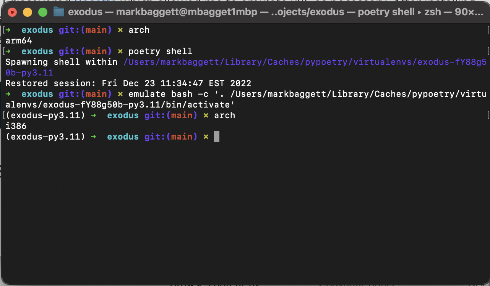
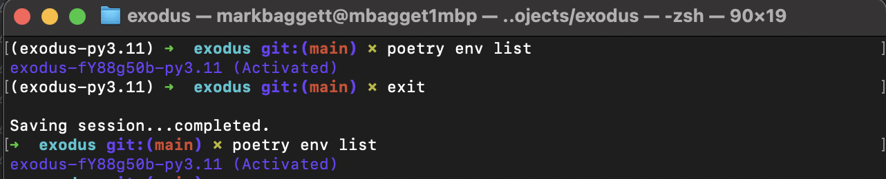

Addressing Self-Induced Poetry Problems on my M1 MacBook
########################################################

:date: 2022-12-23
:tags: poetry, m1, osx, macbook
:category: python
:slug: poetry_on_m1
:authors: Mark Baggett
:summary: Moving from development on Linux and System 76 to an M1 Macbook is hard.  This article describes how I address poetry issues when things go wrong.
:description: Moving from development on Linux and System 76 to an M1 Macbook is hard.  This article describes how I address poetry issues when things go wrong.

Since 2015 or 2016, I have used System 76 laptops exclusively with Ubuntu or Pop 0S. Recently, a
change in university procurement policy required me to switch my university issued System 76 Oryx Pro to either a M1
Macbook or Dell Laptop. Since, nearly everyone I know uses a Macbook, I thought I'd try giving development with OSX
another shot.

While I'm still figuring things out, the hardest transition for me so far personally has been porting over my Python
development practice to this new hardware. Currently, I use `poetry <https://python-poetry.org/>`_ for dependency
management and deployment with `Pycharm <https://www.jetbrains.com/pycharm/>`_ as an IDE.

When I got the M1 Macbook, I did not realize how many of my core dependencies were compiled for x86 architecture and had
no ARM equivalent. Therefore, I'd install an application with `poetry install` and get no errors until I ran the application.
When I ran the application in the wrong architecture, it errored with a message telling me a depenedency installed had
been compiled for x86 or ARM.

It didn't take long until I discovered `Rosetta <https://en.wikipedia.org/wiki/Rosetta_(software)>`_ which allowed me to
emulate x86 as necessary. After installing Rosetta, I cloned Terminal and specified the clone to open with Rosetta.
Now, when I print architecture with `arch` in a terminal I get `arm64` when not using Rosetta and `i386` when I am. This
little trick can be invaluable when things go wrong.

.. code-block:: shell

    arch
    `i386`

####################
When Things Go Wrong
####################

Occasionally, I will still encounter errors like above even when I'm in a terminal that is emulating x86 or ARM.  This
often happens because of `poetry` and my inconsistent workflow. The `poetry` shell is always tied to whatever the architecture
was when the application was installed. Therefore, if you do `poetry install` in a ARM terminal but later do `poetry shell`
from a terminal with Rosetta, it will still use that original architecture like below.

When this happens and poetry has been installed or initialized in the wrong environment, you need to remove the
environment. To do this, start by getting the id for the environment with `poetry env list`. I'm not clear exactly how
this works, but you can use the command whether the poetry environment is activated or not:

You can get more information about the environment with `poetry env info`, but the command will not show the architecture.

When you're ready, you can remove the environment by specifying its identifier and then reinstall in the correct architecture.

.. code-block:: shell

    poetry env remove exodus-fY88g50b-py3.11
    poetry install

While all of this may seem obvious, this problem has cost me countless hours as well as significant hair loss. Hopefully,
taking the time to write this out will ensure this happens less frequently in the future.
